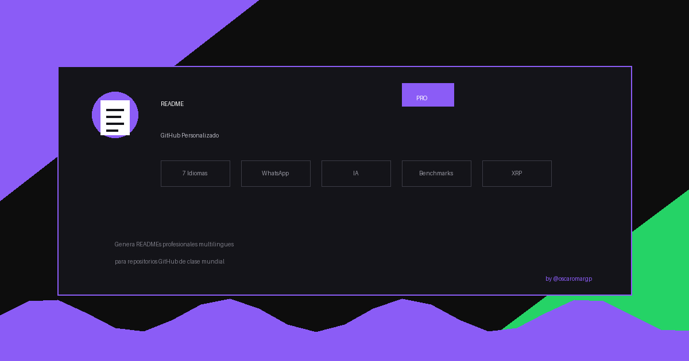

<p align="center">
  
</p>

<h1 align="center">README GitHub Personalizado PRO</h1>

<p align="center">
  <strong>Skill ULTRA COMPLETO para crear READMEs profesionales multilingües en GitHub</strong>
</p>

<p align="center">
  <a href="https://github.com/oscaromargp/readme-github-personalizado-pro">
    
  </a>
  <a href="https://skills.sh">
    
  </a>
  <a href="https://wa.me/526121077805">
    
  </a>
</p>

<p align="center">
  
  
  
  
  
</p>

<p align="center">
  
  
  
</p>

---

## 📖 Acerca del Proyecto

Skill ULTRA COMPLETO para generar READMEs profesionales multilingües en GitHub. Soporta 7 idiomas, banner interactivo con accesos directos, badges de tecnologías e IA, sección de modelos y datos técnicos, preguntas vía WhatsApp, email directo, capturas de pantalla, GIFs, y más.

Inspirado en los repositorios más estelares del ecosistema open source. Perfecto para desarrolladores que quieren que sus proyectos destaquen con documentación de clase mundial.

---

## ✨ Características

| Característica | Descripción |
|---|---|
| 🌍 **7 Idiomas** | ES, EN, PT, FR, DE, JA, ZH con selector visual |
| 🧠 **Sección IA** | Arquitectura, métricas y datos de entrenamiento |
| 📊 **Benchmarks** | Datos técnicos y rendimiento |
| 💬 **WhatsApp** | Contacto directo +52 612 107 7805 |
| 📧 **Email** | Badge clickeable con asunto predefinido |
| 🎯 **Banner Ultra** | Enlaces a repo, demo, docs, WhatsApp |
| 📸 **Capturas** | Galería de hasta 6 imágenes |
| 🏗️ **Arquitectura** | Estructura de carpetas del proyecto |
| 🧪 **Testing** | Sección con badges de coverage |
| 💎 **XRP** | Dirección para donaciones |

---

## 📸 Capturas de pantalla

<p align="center">
  
</p>

---

## 🚀 Comenzando

### Prerrequisitos

| Herramienta | Versión |
|---|---|
| Claude Code / Cursor / Windsurf | Latest |
| Git | >= 2.0 |

### Instalación

```bash
# Clona este repositorio
git clone https://github.com/oscaromargp/readme-github-personalizado-pro.git

# O instálalo como skill en tu herramientas de IA
# (consulta la documentación de tu herramienta)
```

---

## 💡 Uso

### Ejemplo básico

Simplemente menciona en tu proyecto:

- "crear README"
- "documentar repo"
- "hacer el README bonito"
- "agregar badges"
- "documentación profesional"

Y el skill generará automáticamente:

- 📋 README.md completo
- 🌍 Versiones en otros idiomas (si se solicitan)
- 📁 assets/README_IMAGES.md (guía para imágenes)

### Ejemplo de salida

```markdown
<p align="center">
  <h1>Mi Proyecto Increíble</h1>
</p>

<p align="center">
  <a href="https://github.com/user/repo"></a>
  <a href="https://demo.com"></a>
</p>

## 📖 Acerca del Proyecto
...
```

---

## 🤝 Contribuyendo

¡Las contribuciones son bienvenidas!

```
1. Fork del repositorio
2. Crea tu Rama (git checkout -b feature/increible)
3. Commit de tus cambios (git commit -m 'feat: algo increible')
4. Push a la rama (git push origin feature/increible)
5. Abre un Pull Request
```

---

## 💬 Preguntas y Soporte

<p align="center">
  <a href="https://wa.me/526121077805?text=Hola%20Oscar%2C%20vi%20tu%20skill%20de%20README%20y%20quisiera%20preguntarte...">
    
  </a>
  <a href="mailto:oscaromargp@gmail.com?subject=Consulta%20sobre%20skill%20README">
    
  </a>
</p>

---

## 💖 Apoya este Proyecto

Si este proyecto te fue útil, considera apoyarlo.

> **Dirección XRP**: `rBthUCndKy3Xbb19Ln4xkZeMwusX9NrYfj`

---

## 📄 Licencia

Distribuido bajo la licencia MIT.

---

## 📬 Contacto

<p align="center">
  <strong>Oscar Omar Gómez Peña</strong>
</p>

<p align="center">
  <a href="https://oscaromargp.github.io/Oscaromargp/">
    
  </a>
  <a href="https://github.com/oscaromargp">
    
  </a>
  <a href="https://wa.me/526121077805">
    
  </a>
</p>

---

## 🙏 Agradecimientos

<p align="center">
  <br/>
  <em>
    "Porque Dios es el que en vosotros produce<br/>
    así el querer como el hacer,<br/>
    por su buena voluntad."
  </em>
  <br/>
  <strong>— Filipenses 2:13</strong>
  <br/><br/>
  Todo lo que aquí existe nació primero como un deseo en el corazón.<br/>
  Cada proyecto, cada línea, cada idea que toma forma —<br/>
  es un regalo de Aquel que nos dio tanto el sueño como la fuerza de alcanzarlo.<br/>
  <strong>A Dios, toda la gloria.</strong>
  <br/>
</p>